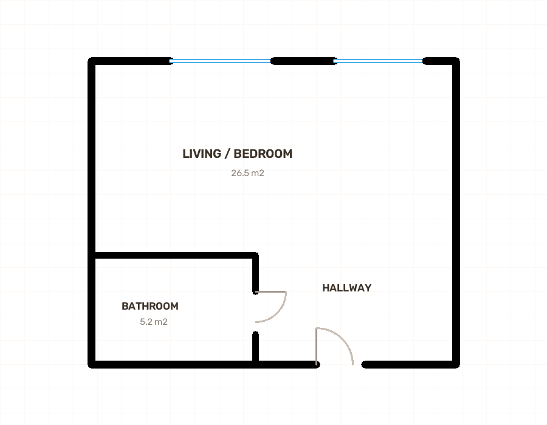
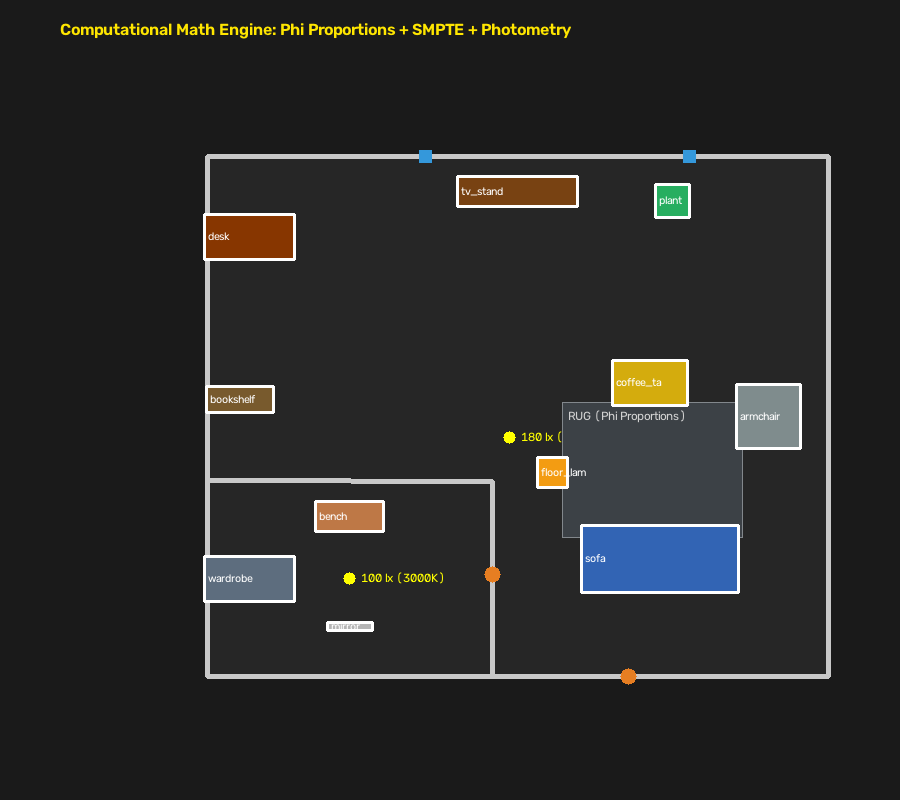
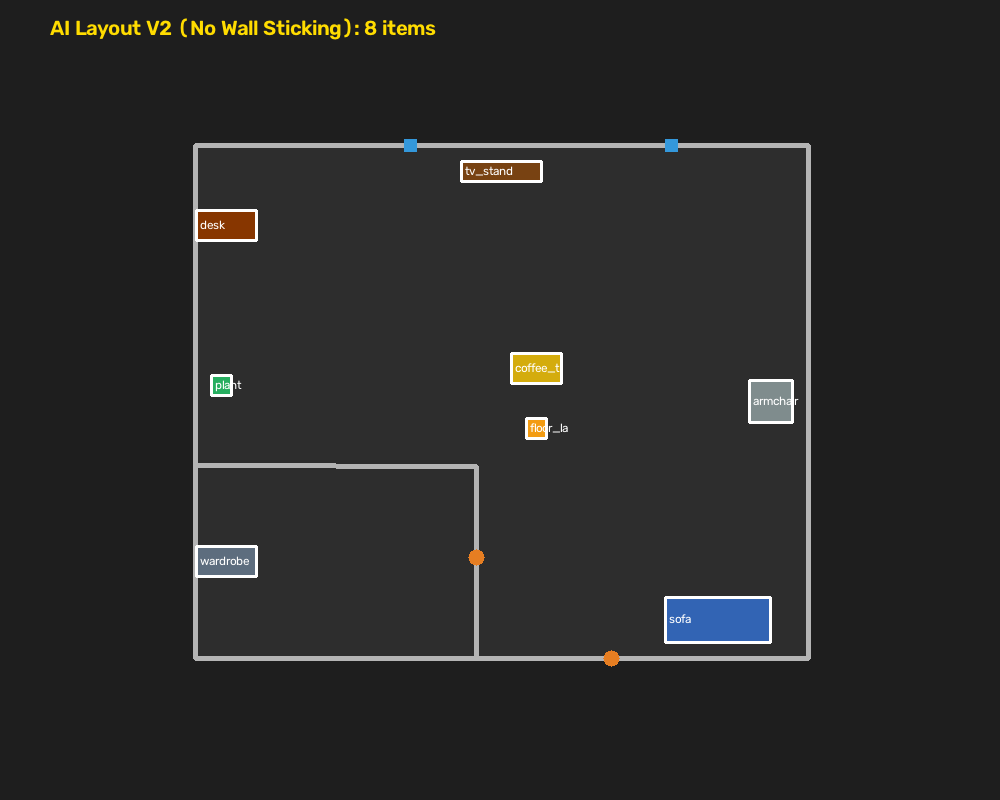

# ✦ AI Interior Designer

[](https://fastapi.tiangolo.com)
[](https://nextjs.org)
[](https://threejs.org)
[](https://taskiq-python.github.io)
[](https://shapely.readthedocs.io)
[](https://opensource.org/licenses/MIT)

> **Built by Ilyas Salimov** — Senior Full-Stack & AI Engineer  
> 💼 *Available for freelance projects, AI Solutions Architecture & Full-Stack MVPs.*  
> 📬 *Contact: [LinkedIn](https://linkedin.com) • [Telegram](https://t.me)*

---

Веб-платформа нового поколения: пользователь загружает план квартиры/дома → мультиагентная AI-система выполняет CV-сегментацию, строит топологический граф стен, применяет **математическое ядро дизайна (Computational Math Engine)** и генерирует эргономичный 3D-интерьер с возможностью редактирования через чат и в интерактивном 3D-пространстве.

---

## 📸 Визуальные результаты генерации (Showcase)

| 1. Исходный чертёж (Input) | 2. 2D Math Layout & Светотехника | 3. Интерактивная 3D Сцена (Three.js) |
|:---:|:---:|:---:|
|  |  |  |
| *Загрузка PNG/JPG чертежа* | *Золотое сечение, зоны, ковры, люксы* | *WebGL рендер, walk-режим, Drag&Drop* |

---

## 🚀 Ключевые возможности платформы

1. **Байесовский оценщик масштаба (Bayesian Scale Estimator)**:
   * Динамическое взвешенное слияние априорных архитектурных пропорций жилых комнат и разрешения изображения. Автоматически переводит пиксели в метры без ручной калибровки.
2. **Топологический граф стен (Topological Wall Graph & Consensus)**:
   * Автоматическая дедупликация общих межкомнатных перегородок, вероятностный скоринг проёмов и классификация окон/дверей.
3. **Вычислительный математический движок (Computational Math Engine)**:
   * **Золотое сечение ($\Phi \approx 1.618$)**: Диван занимает $62\%$ стены, ковёр пропорционален $1.20 \times L_{\text{sofa}}$, столик — $0.55 \times L_{\text{sofa}}$.
   * **Эргономика SMPTE**: Расчёт точной дистанции комфортного просмотра ТВ ($D = 1.60 \times \text{Diagonal}$).
   * **Индекс плотности застройки ($K_{\text{occ}} = 0.35$)**: Баланс мебели и свободного пространства пола.
   * **Физическая релаксация (Force-Directed Spring Solver)**: Автоматическое стягивание парных связей и отталкивание от дверных проёмов ($\ge 0.95\text{ м}$).
   * **Колористика $60-30-10$**: Балансировка базовых, структурных и акцентных оттенков.
   * **Фотометрический расчёт света**: Определение люксов ($100-400\text{ лк}$) и температуры Кельвина ($2700-4000\text{ K}$) по СНиП.
4. **CAD-компилятор с геометрической верификацией Shapely**:
   * Буферизация стен ($22\text{ см}$ отступ), эргономические проходы ($55\text{ см}$ между мебелью), защита радиуса открывания дверей.
   * Многослойная интерьерная композиция (5 слоёв: фокусы, компаньоны, текстиль/ковры, вертикальный декор, свет).
5. **Процедурный 3D-рендеринг в Three.js / React Three Fiber**:
   * Кастомные 3D-модели: диваны, столы, стулья, кровати, растения, ковры (`Rug3D`), ТВ-тумбы с экраном (`TVStand3D`), торшеры (`FloorLamp3D`), гардеробы (`Wardrobe3D`), стеллажи (`Bookshelf3D`).
   * Walk-режим камеры от первого лица с коллизиями о стены + Drag-and-Drop мебели.
6. **Генерация вариантов дизайна и PDF-экспорт**:
   * Параллельная генерация 3 вариантов стиля (A: Modern, B: Japandi, C: Luxury).
   * Экспорт профессионального PDF-паспорта проекта (2D-планировка, спецификация мебели, ориентировочная смета).

---

## 🛠 Технологический стек

| Слой | Технологии |
|---|---|
| **Frontend** | Next.js 15 (App Router, Turbopack), TypeScript, Tailwind CSS, Zustand |
| **3D Engine** | Three.js, React Three Fiber (R3F), Drei, PointerLockControls |
| **Backend** | FastAPI (async), Pydantic v2, Shapely 2.0 (CAD-геометрия) |
| **Очереди задач** | Taskiq + Redis (асинхронные пайплайны и распределённые брокеры) |
| **База данных** | MongoDB (Motor async-драйвер) |
| **Файловое хранилище** | S3-совместимое (MinIO локально, Cloudflare R2 / AWS S3 в проде) |
| **LLM & Vision** | Groq API (Llama-3.3-70b-versatile, low-latency инференс) |
| **CV & Математика** | OpenCV, NumPy, Shapely Polygon Topology, Bayesian Prior Estimator |

---

## 🏛 Архитектура мультиагентного конвейера

```
┌──────────────────────── run_analysis_pipeline ────────────────────────┐
│ Upload (PNG/JPG)                                                      │
│   → Bayesian Scale Estimator  (динамическая калибровка px/m)          │
│   → Floor Plan Analyzer       (CV-сегментация + Wall Graph)           │
│   → Topological Consensus     (дедупликация стен и проёмов)           │
│   → Room Detector             (LLM классификация функционала комнат)  │
│   → Architect Agent           (1-2 варианта умной перепланировки)     │
│ Сохранение сцены v1 в MongoDB, статус → awaiting_architect_decision   │
└───────────────────────────────────────────────────────────────────────┘
                                   │
                         выбор пользователя
                                   │
┌──────────────────────── run_design_pipeline ──────────────────────────┐
│   → Architect Agent.apply_suggestion  (пересчёт геометрии комнат)     │
│   → Semantic Bridge           (генерация архитектурного брифа)        │
│   → Interior Designer         (палитра по правилу 60-30-10)           │
│   → Furniture Planner + Math  (Золотое сечение, SMPTE, Occupancy)    │
│   → Shapely CAD Compiler V2   (буферизация стен, коллизии, проходы)   │
│   → Force-Directed Relaxation (физическая релаксация парных связей)   │
│   → Photometric Lighting      (расчёт люксов, спотов и Кельвинов)     │
│   → Scene Generator           (финальная сборка 3D-сцены A/B/C)       │
│ Сохранение сцены, статус → ready                                      │
└───────────────────────────────────────────────────────────────────────┘

AI Chat (Conversation Agent):
Реплика пользователя → генерация точечного JSON Patch (add/update/remove) →
версионирование сцены (v1 -> v2 -> v3) без полной перегенерации.
```

---

## 📐 Математические законы и формулы ядра ([math_engine.py](file:///Applications/projects/ai-interior-designer/backend/app/agents/furniture_planner/math_engine.py))

1. **Золотое сечение ($\Phi = 1.618$)**:
   $$L_{\text{sofa}} = \frac{L_{\text{wall}}}{\Phi}, \quad L_{\text{rug}} = 1.20 \cdot L_{\text{sofa}}, \quad L_{\text{table}} = 0.55 \cdot L_{\text{sofa}}$$
2. **Дистанция SMPTE для ТВ**:
   $$D_{\text{viewing}} = \text{Diagonal}_{\text{TV}} \times 1.60 \quad (55'' \to 2.24\text{м}, \ 65'' \to 2.64\text{м})$$
3. **Индекс плотности застройки ($K_{\text{occ}}$)**:
   $$A_{\text{furniture\_target}} = 0.35 \times A_{\text{room\_area}}$$
4. **Физическая релаксация (Force-Directed Relaxation)**:
   $$F_{\text{att}} = k \cdot (r - r_0), \quad F_{\text{rep}} = \frac{c}{r^2}$$
5. **Фотометрия Ламберта (Люксы и Люмены)**:
   $$\Phi_{\text{total}} = \frac{E_{\text{target}} \cdot A_{\text{room}}}{\text{CU} \cdot \text{MF}}$$

---

## 📂 Структура репозитория

```
ai-interior-designer/
├── docker-compose.yml        # mongo, redis, minio, backend, worker, frontend
├── backend/
│   ├── app/
│   │   ├── agents/            # Мультиагентная система
│   │   │   ├── architect/          # Перепланировка и слияние комнат
│   │   │   ├── conversation/       # Обработка чата и патчи сцены
│   │   │   ├── decorator/          # Декор и растения
│   │   │   ├── floorplan_analyzer/
│   │   │   ├── furniture_planner/  # CAD Compiler + Math Engine + 5 слоёв
│   │   │   │   ├── agent.py
│   │   │   │   ├── compiler.py     # Shapely CAD Compiler V2
│   │   │   │   └── math_engine.py  # Математическое ядро
│   │   │   ├── interior_designer/
│   │   │   ├── lighting_designer/  # Фотометрический расчёт люксов
│   │   │   ├── room_detector/
│   │   │   └── scene_generator/
│   │   ├── api/routes/         # projects, chat, upload, export, ws
│   │   ├── core/               # config, mongo, redis, s3, groq-клиент
│   │   ├── cv/                 # CV-сегментация, Wall Graph, Semantic Bridge
│   │   ├── export/             # PDF-генератор со сметой и шрифтом DejaVu
│   │   ├── models/             # Pydantic: Scene, Project, FurnitureItem
│   │   └── tasks/              # Taskiq брокер и пайплайны
│   ├── tests/                  # 53 автоматических unit/integration тестов
│   └── requirements.txt
└── frontend/
    ├── app/page.tsx            # Главная страница и пайплайн
    ├── components/
    │   ├── SceneViewer.tsx     # Three.js / R3F с 3D-моделями и walk-режимом
    │   ├── VariantSwitcher.tsx # Переключатель вариантов дизайна (A/B/C)
    │   ├── PreferencesForm.tsx # Анкета пожеланий
    │   ├── ArchitectChoice.tsx # Выбор перепланировки
    │   └── ChatPanel.tsx       # AI-ассистент
    ├── lib/store.ts            # Zustand стейт-менеджмент
    └── package.json
```

---

## ⚡ Быстрый старт

### Вариант 1: Запуск через Docker Compose (Рекомендуется)

```bash
# 1. Настройка окружения Backend
cp backend/.env.example backend/.env
# Укажите GROQ_API_KEY в backend/.env

# 2. Настройка окружения Frontend
cp frontend/.env.local.example frontend/.env.local

# 3. Запуск всех сервисов
docker compose up --build
```

* **Frontend**: `http://localhost:3000`
* **Backend API**: `http://localhost:8000/docs`
* **MinIO Storage Console**: `http://localhost:9001` (`minioadmin` / `minioadmin`)

---

### Вариант 2: Локальный запуск для разработки

**Backend:**
```bash
cd backend
python -m venv venv && source venv/bin/activate
pip install -r requirements.txt
uvicorn app.main:app --reload --port 8000

# В отдельном терминале (Taskiq Worker):
taskiq worker app.tasks.broker:broker app.tasks.pipeline_tasks
```

**Frontend:**
```bash
cd frontend
npm install
npm run dev
```

---

## 🧪 Тестирование

Проект покрыт всесторонними unit- и сквозными интеграционными тестами (чистая геометрия, CAD-компилятор, математическое ядро, экспорт PDF):

```bash
cd backend
source venv/bin/activate
pytest -v
```

> **53 теста успешно выполняются за ~1.6 секунды.**

---

## 📜 Лицензия

Распространяется под лицензией [MIT](LICENSE).
